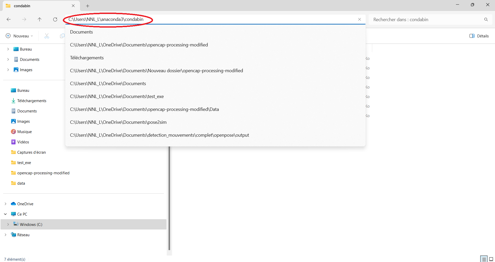
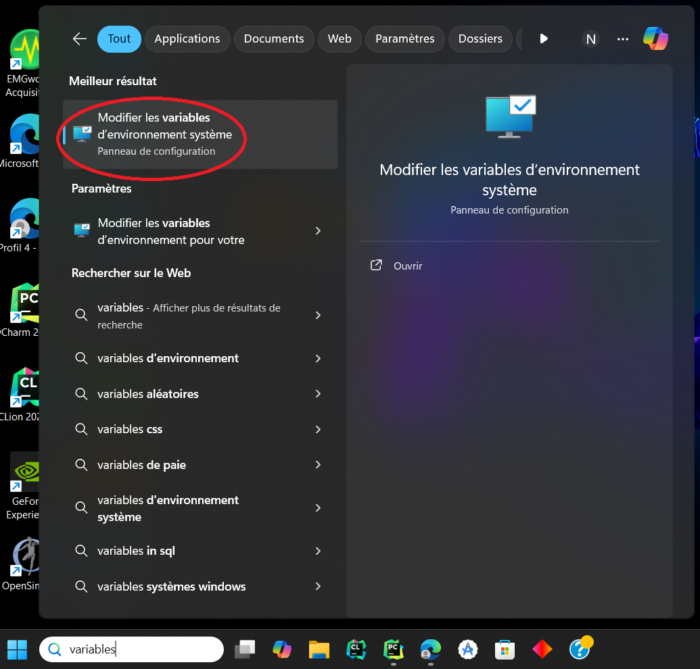
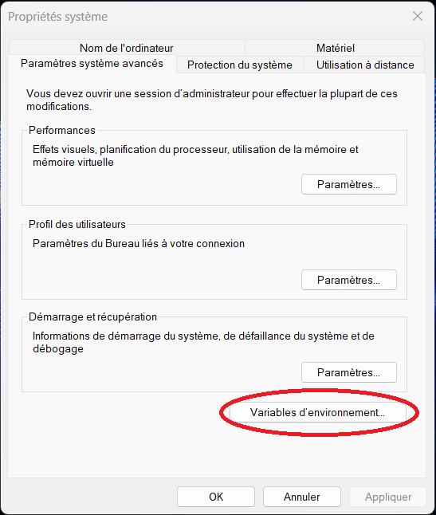
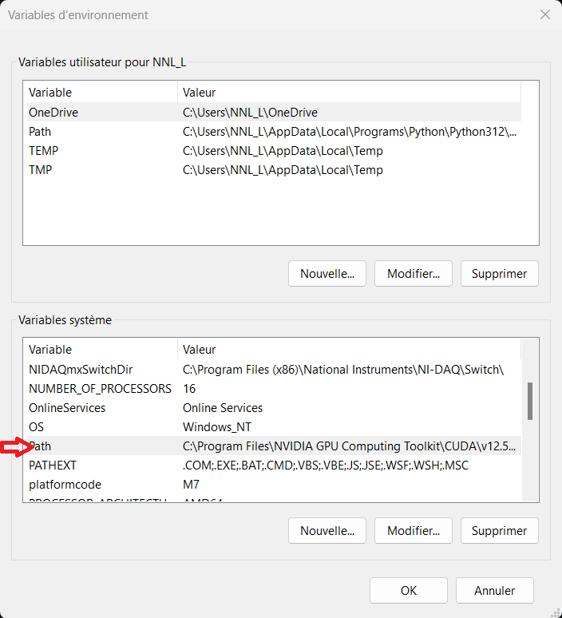
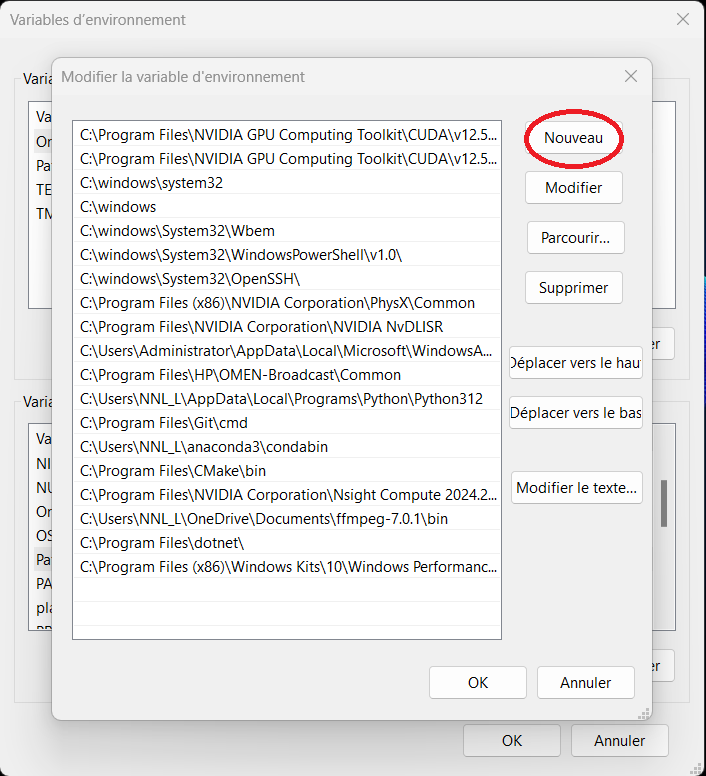
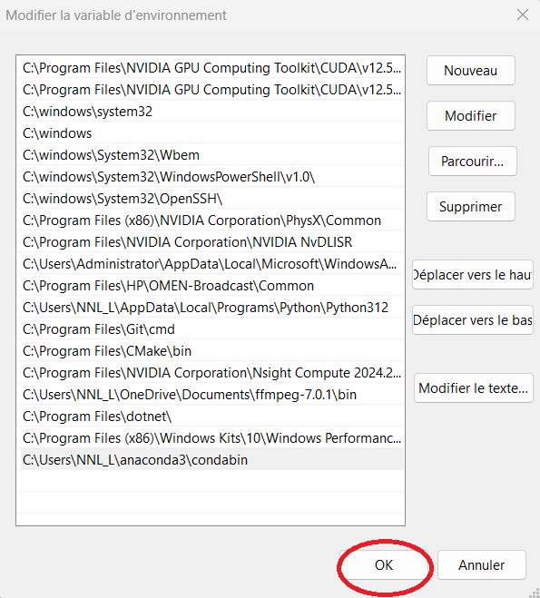

# OpenCap Analysis

This code is a copy of OpenCap Processing, with some additional features and a better user experience. The original code
can be found [here](https://github.com/stanfordnmbl/opencap-processing).

## Install requirements

### General

#### Install [Anaconda](https://www.anaconda.com/)
#### **Windows only**: Install [Visual Studio](https://visualstudio.microsoft.com/downloads/)
    - The Community variant is sufficient and is free for everyone.
    - During the installation, select the *workload Desktop Development with C++*.
    - The code was tested with the 2017, 2019, and 2022 Community editions.

#### **Linux only**: Install OpenBLAS libraries
- `sudo apt-get install libopenblas-base`

#### Updating Environment Variables

1. Open your file explorer

2. Search for the `condabin` folder, usually located in `C:\Users\<YourName>\Anaconda3\`, and copy the path.

3. Click on the search bar and look for "variables", then click on the first result that appears.

4. Click on "Environment Variables".

5. In the System Variables, find "Path" and double-click on it.

6. Click on "New".

7. Paste the path, then close everything.

### Download and run the following `.bat` files in this order to complete the setup:

1. [set_execution_policy.bat](https://github.com/LabNNL/opencap-analysis/blob/main/set_execution_policy.bat)
2. [start_conda_setup.bat](https://github.com/LabNNL/opencap-analysis/blob/main/start_conda_setup.bat)

### Open opencap-analysis in the folder you indicated in the previous step and run start.bat
